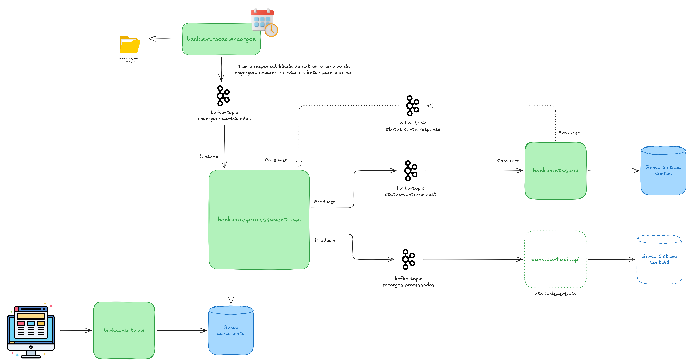

# 🏦 Bank — Sistema de Processamento de Encargos em Alta Vazão

[](https://www.oracle.com/java/)
[](https://spring.io/projects/spring-boot)
[](https://kafka.apache.org/)
[](https://www.postgresql.org/)

Este projeto é uma solução de alta performance para o processamento diário de **20 milhões de lançamentos de encargos** em contas correntes. A arquitetura foi desenhada seguindo os princípios da **Arquitetura Hexagonal (Ports & Adapters)** e **Arquitetura Orientada a Eventos (EDA)** para garantir escalabilidade, resiliência e baixo acoplamento.

---

## 🏗️ Arquitetura do Sistema

O sistema é composto por 4 microserviços que se comunicam de forma assíncrona via Apache Kafka.



### 🧩 Microserviços

| Serviço | Função | Porta |
|---|---|---|
| **bank-extracao-encargos** | Lê CSV (Local ou S3) e publica no Kafka (Stream Lazy). | `8050` |
| **bank-processamento-core-api** | Orquestra o fluxo, persiste estados e valida regras de negócio. | `8070` |
| **bank-contas-api** | Sistema de registro de contas; responde status (Ativo, Cancelado, etc). | `8082` |
| **bank-consulta-api** | API de consulta online (CQRS) com banco de leitura dedicado. | `8040` |
---

## 🚀 Performance e Escalabilidade

O desafio técnico exige processar **20 milhões de registros em uma janela de 2 horas**.

### Estratégias Utilizadas:
- **Batch Processing**: Consumo e persistência em lotes (até 500 registros por poll).
- **Virtual Threads (Java 21)**: Alta concorrência com baixo overhead de memória.
- **Idempotência**: Garantia de processamento único via UUIDs (`idLancamento`).
- **Agregação Contábil**: Redução de contenção em banco através de um único UPDATE por conta por lote.
- **Stream Lazy**: Leitura de arquivos gigantes sem carregar tudo na memória (RAM footprint estável).

---

## 🛠️ Tecnologias

- **Linguagem:** Java 21 (Records, Virtual Threads).
- **Framework:** Spring Boot 3.4.
- **Mensageria:** Apache Kafka (Confluent Distrib.).
- **Banco de Dados:** PostgreSQL 15.
- **Observabilidade:** Prometheus, Grafana e Micrometer.
- **Infraestrutura:** Docker e Docker Compose.

---

## 📦 Como Executar

### Pré-requisitos
- Docker e Docker Compose instalado.
- Java 21 (para rodar os serviços fora do container, se desejado).

### Passos
1. **Subir a Infraestrutura:**
   ```bash
   cd infra
   docker compose up -d
   ```
   *Isso subirá o Kafka, Postgres, Prometheus e Grafana.*

2. **Resetar Tópicos (Opcional):**
   ```bash
   ./reset-topics.sh
   ```

3. **Executar os Microserviços:**
   Cada pasta possui um wrapper do Maven. Você pode rodar:
   ```bash
   ./mvnw spring-boot:run -Dspring-boot.run.profiles=local
   ```

---

## 📊 Observabilidade

Acesse as ferramentas de monitoramento para acompanhar a vazão em tempo real:

- **Grafana:** `http://localhost:3000` (User: `admin` / Pass: `admin`)
- **Prometheus:** `http://localhost:9090`
- **Redpanda Console (Kafka UI):** `http://localhost:8080`

### Principais Métricas:
- `kafka_consumer_records_consumed_total`: Vazão de mensagens processadas.

---

## 🛡️ Qualidade de Código (Testes)

O projeto utiliza **JUnit 5** e **Mockito** para testes unitários, focando na pureza da camada de domínio e na corretude dos Use Cases sem depender de infraestrutura externa.

Execute os testes com:
```bash
./mvnw test
```

---

> Desenvolvido como estudo de caso para arquiteturas de alta vazão e resiliência.
